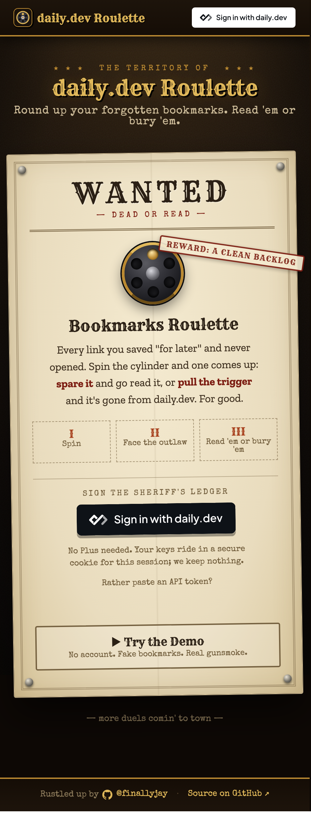
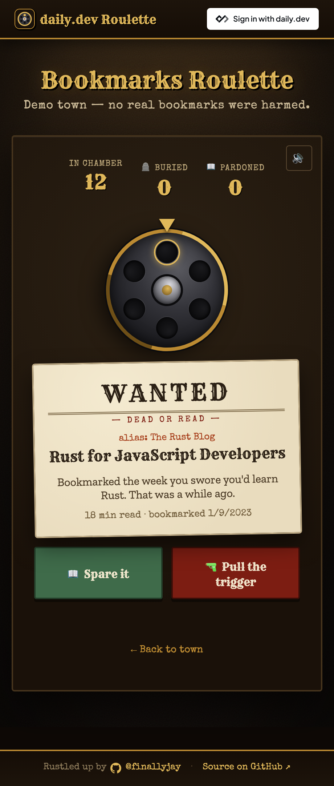

#  daily.dev Roulette

[](https://daily-dev-roulette.vercel.app)
[](https://github.com/finallyjay/daily-dev-roulette/actions/workflows/ci.yml)
[](./LICENSE)
[](https://astro.build)
[](./package.json)
[](./tests/e2e)

A daily.dev hackathon project. Put your daily.dev habits on the line, one spin at a time. It's built as a hub of "roulette" modes — the first (and currently only) mode is **Bookmarks Roulette**, with room to add more.

<p align="center">
  
  
</p>

## Bookmarks Roulette

Your bookmarks pile up and rot — this forces a reckoning. One spin serves one bookmark: **read it** (spared) or **pull the trigger** (deleted forever). Funny, but it actually drains your backlog.

### Two ways to play

- **Demo mode** — runs entirely in the browser on a fake bookmark pile. No account, no token required. This is the headline experience and always works.
- **Real mode** — **Sign in with daily.dev** (OAuth, authorization code + PKCE; no Plus subscription needed). Tokens are stored in httpOnly cookies and access tokens are refreshed server-side; every API call is proxied through Astro server routes, so no token ever touches client JS and there are no CORS issues. Deletes hit the real `DELETE /bookmarks/{id}` endpoint.

The deployed app never asks for a personal API token. Under `pnpm dev` only, a "paste an API token" form is available, since daily.dev's OAuth can't redirect to localhost.

## Run locally

```bash
pnpm install
pnpm dev      # http://localhost:4321
```

## Deploy

Targets Vercel out of the box (`@astrojs/vercel`, `output: "server"`). Push and import, or `vercel`. No env vars required (demo mode is fully client-side).

## Architecture

- `src/layouts/Layout.astro` — shared shell: global styles + header (avatar/name + sign out)
- `src/pages/index.astro` — the hub: sign-in + the list of roulette modes
- `src/pages/roulette.astro` — Bookmarks Roulette game (demo via `?demo=1`, else requires login)
- `src/pages/api/auth/index.ts` — sign in with a token (validate → set cookie) / sign out
- `src/pages/api/auth/login.ts`, `callback.ts` — "Sign in with daily.dev" OAuth flow (`src/lib/oauth.ts`)
- `src/middleware.ts` — refreshes expiring OAuth access tokens before each request
- `src/pages/api/bookmarks/*` — server-side proxy: list (paginated) + delete
- `src/lib/daily.ts` — daily.dev Public API client (server only): bookmarks + profile
- `src/lib/auth.ts` — resolves the current user from the session cookie
- `src/lib/session.ts` — httpOnly cookie session
- `src/lib/mock.ts` — demo-mode fake bookmarks

## API notes

daily.dev's Public API is REST + Bearer tokens (personal tokens or [OAuth app](https://docs.daily.dev/oauth-apps/) tokens), available to any daily.dev account. Set `DAILY_OAUTH_CLIENT_ID` / `DAILY_OAUTH_CLIENT_SECRET` (see `.env.example`) to enable sign-in; without them a deployment only offers the demo. Endpoints used: `GET /bookmarks/` (cursor-paginated), `DELETE /bookmarks/{id}`, `GET /profile/`. Other resources exist (feeds, follows, tech stack) — candidates for future roulette modes. See `spike/spike.mjs` for a standalone API probe.
